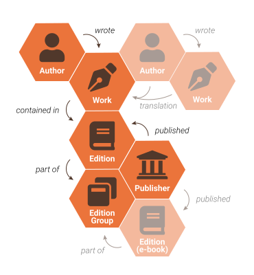

# Getting started

Let's start by introducing the basic concepts we use to represent the data in BookBrainz.

The following 6 entities and the way they are linked together allow us to describe what "a book" really is.

When you think about the book you have in your hands, there are actually multiple interconnected concepts; here is how we break it down in BookBrainz:

* **Author** – an individual, group or collective that participates in the creative process of an artistic work. It also includes translators, illustrators, editors, etc.
* **Work** – a distinct intellectual or artistic creation expressed in words and/or images. Here we are not talking, for example, about a physical book, but the story, introduction,  illustrations, etc. it contains.
	- Examples: novel, poem, translation, introduction & foreword, article, research paper, etc.
* **Edition** – a published physical or digital version of one or more Works. This is for example the book you're currently holding in your hands!
	- Examples: book, anthology, comic book, magazine, leaflet
	- Note: An Author can self-publish an Edition
* **Edition Group** – a logical grouping of different Editions of the same book.
	- Example: paperback, hardcover and e-book editions of a novel
* **Publisher** – publishing company or imprint that publishes litterature.
* **Series** - A representation of serialized items, both conceptual (a story spanning multiple books) and physical (periodical publications such as magazines or newspapers).

### Examples
The following examples should help you understand the different entities and how they relate to each other:
The relationship between [H.P Lovecraft](https://bookbrainz.org/author/ac59097e-7f86-436d-9308-f6e63871ceff) , his short story [*At the Mountains of Madness*](https://bookbrainz.org/work/97eafaf5-377a-4703-a12e-d66a30fcfda1) and an Edition [*The Classic Horror Stories*](https://bookbrainz.org/edition/b3ed75ea-9f74-44fa-833e-fa2c895c6b12) which contain it and several more works.

The publisher [Orbit Books](https://bookbrainz.org/publisher/b065b24d-136f-45e3-badc-48aea4728c73) published a [paperback](https://bookbrainz.org/edition/54331325-d11b-47f4-bb74-0485e582c52e) and an [e-book](https://bookbrainz.org/edition/3fa9fdcd-098d-4ec1-82e4-f5fdfb92c41f) editions of the novel [*Ancillary Mercy*](https://bookbrainz.org/work/74b96fa7-e19d-4690-bb63-6fa3c07527f6) (by [Ann Leckie](https://bookbrainz.org/author/b2507eee-1391-47c5-93e6-ca972bd8e0e0)), making them part of the same [Edition Group](https://bookbrainz.org/edition-group/540e9c4a-f9fa-427b-a41f-bb12c48f902b) of the same name.

## How do I add a book?

Now that you know a bit more about BookBrainz and you're excited to contribute, have a look at our tutorial on [how to add a book](./tutorials/add-a-book.md)

## Can I create a digital bookshelf?

Absolutely!
We have user-created [Collections](https://bookbrainz.org/collections) which can either be private or public.
They can be great discovery tools, as well as allowing you to create your digital bookshelf.

## What about ratings and reviews?

You can also rate and  write reviews for your favorite books and help other users expand their reading list.

To do so, we use one of our sister projects: [CritiqueBrainz](https://critiquebrainz.org/)
All reviews published on CritiqueBrainz are also completely open (Creative Commons license)