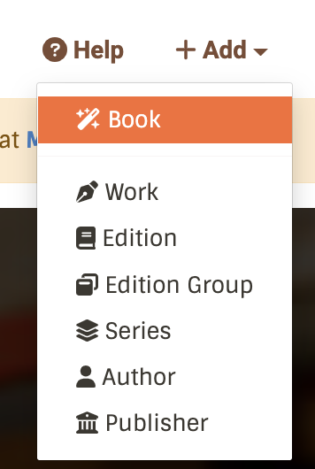

# How do I add a book?

If you're interested in contributing to BookBrainz, the first question you're likely to have is "How do I add my favorite book?".

First of all, it's a good idea to check if it's already in our database by [searching for it](https://bookbrainz.org/search) and avoid adding a duplicate.

You are looking for a Work (representing the content of the book, the story), and for the specific Edition you have (meaning the same format, publisher, year, etc. )
If you want an overview of what these terms mean, head over to [the getting started page](../getting-started.md).

## Using the Book wizard

The easiest way to add a new book is to use our wizard which will take you through the steps to search for or create each required entity. It hides some of the complexity by creating and automatically linking together the various entities needed to represent "a book".

For each relevant entity, you will be offered to search for or create a new entity. If the entity exists, it is as simple as selecting it. If it does not exist, you will see an option to create a new one, which will open a modal allowing you to fill in all the relevant details.

In the top menu bar, click on "+ Add" and then select "Book":

The form is divided into 4 sections, which we'll cover in more detail below:

* Cover
* Details
* Contents
* Submit

### Cover
This is information typically found on the cover, both front and back: title, author, publisher, ISBN.

Some subtleties:

The Author Credit refers to the author(s) *as it appears on the cover*, which can be different from the author's actual name (for example in the case of a pseudonym), but also allows you to enter multiple authors exactly as styled on the cover.

The language field here refers to the *language of the title*, not the language used in the book.

### Details
Some of this information is typically found on the copyright page (the first page in the book).
The annotation field is a freeform text field that allows you to enter other relevant information that does not fit into other fields.

### Contents
This is where you define which Work or Works are contained in the book. In the case of a novel, you will expect a single Work; for short stories or an omnibus collection for example, you would expect multiple Works.

This section also allows you to easily group together the Works as part of a Series. Here you will be able to organize each part of the series.

### Submit
This section is a recap of the information you are about to submit — or if you have created new entities in the process, of the information that has already been submitted. Please verify it carefully before submitting (the rest of) the book.

## Adding entities separately
If you don't want to enter an entire book or if you know most of the entities you need already exist, you can create entities separately.
Under the same "+ Add" menu you will see listed each entity type.

The [getting started](../getting-started.md) page explains what the different entities are and how they related to each other.

For example, if the book you want to add already exists in the database but you have a different edition of it (different format or ISBN), you can simply add a new Edition entity with all the required details.
There is a convenient shortcut: If you visit the Edition Group page you will see an "+ Add Edition" button under the list of Editions, which will pre-fill some fields for you.