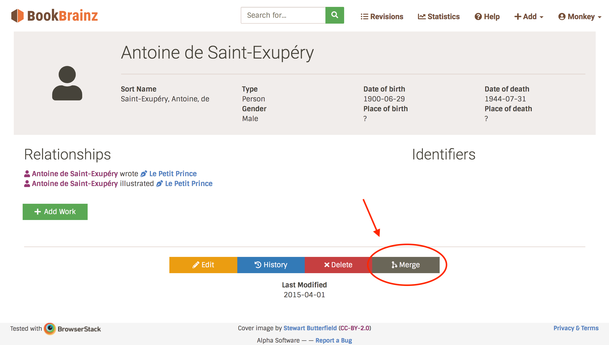
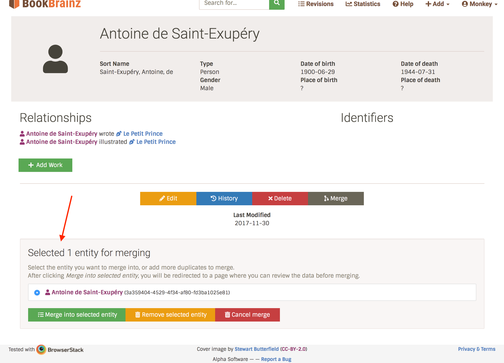
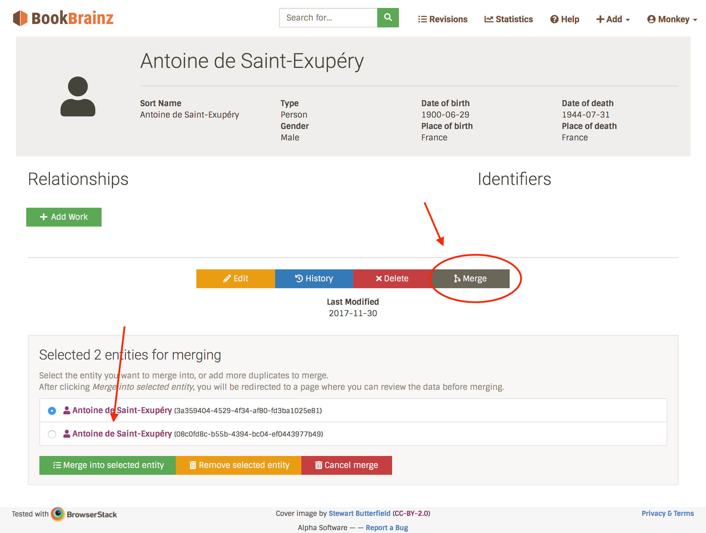
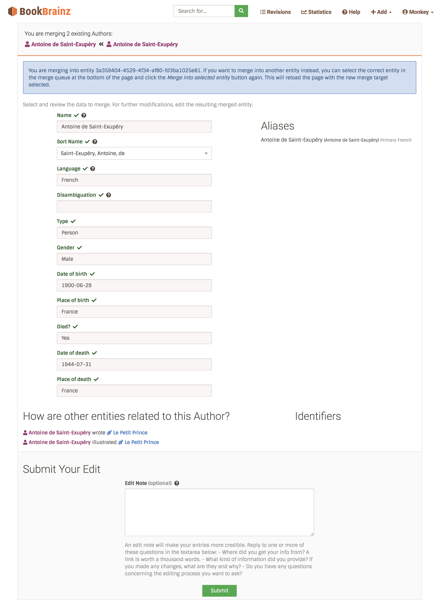
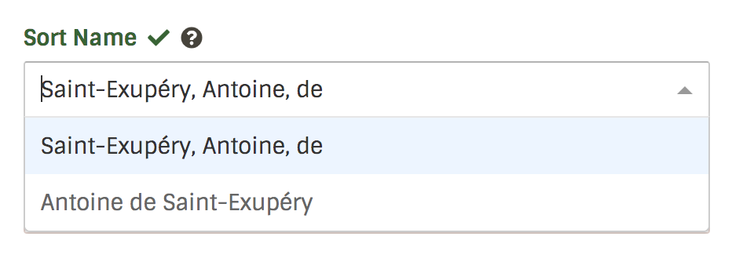
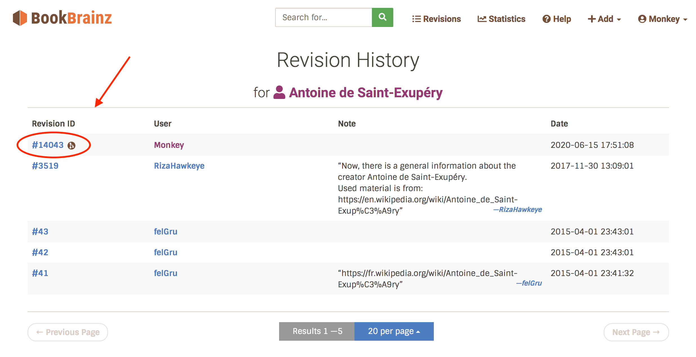

# Merging entities tutorial
-------

You found a duplicate entity in the database? Great! Let's deal with it the best way we can!

Instead of deleting it, let's see how we can merge the duplicates together to make sure we don't lose any data.

### 1. Adding entities to the merge queue
-------
Navigate to the entity you want to merge the duplicates *into*, in the footer buttons, click on the "Merge" button.

Now, at the bottom of each page (apart from the homepage), you will see a *merge queue* section with the elements you selected for merging.

Now repeat the same operation for the duplicate you want to merge. You can add as many entities as you need to merge, but you need at least 2 entities.

If you try adding an entity of another type (for example your merge queue contains Authors, and you add a Work), the current merge queue will be cancelled and a new one will be created.

### 2. Submit/cancel the merge queue
-------
The merge queue gives you a recap of the selected entities, and allows you to select an entity to be removed from the merge queue.
To proceed to the merge page, you will need to select the entity you want to merge the other ones into,and click the "Merge into selected entity" button. You will be taken to a special entity edit page which collects the data from the entities you are merging and displays the options.

You can also cancel the merge queue by clicking on the "Cancel merge" button.

### 3. Entity merging screen
-------
If the entities to be merged have no conflicting data, you will see the information with grayed out fields.

If there are conflicting data, you will see a dropdown  where you can choose which data to keep.

All identifiers, relationships and aliases will be collected and cannot be edited in this screen. if you wish to modify them, you will have to edit the entity before or after merging.

Finally, you can write an edit note to clarify your intent before clicking on the "Submit" button.
And voilà !

### 4. merge revision display
-------
After successfully submitting your merge edit, you will see a merge revision in the entity's history. Merge revisions are denoted with a special icon:

The same goes on the lates revisions page:

If you visit your merge revision, you will see it also has a special formatting that clarifies which entities got merged into which:

### 5. Redirect
-------
If you now try to visit the address of a merged entity, you will be redirected to the entity you merged *into*. That way, the identifiers will always be valid: an old link to a merged entity will still lead you to the correct result .

