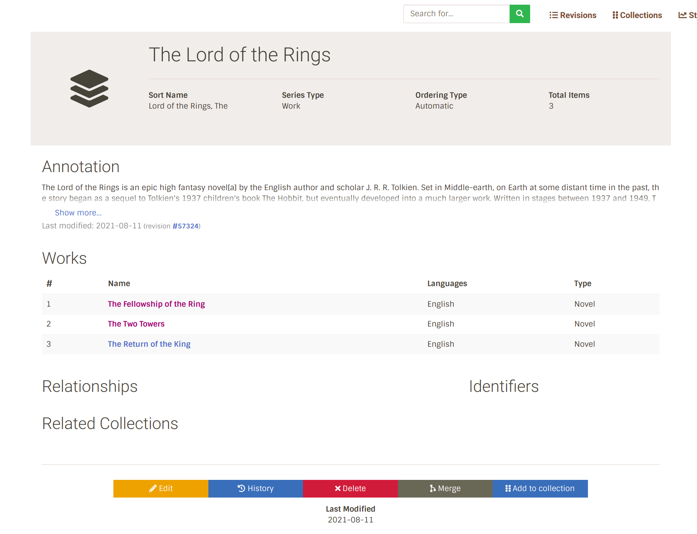
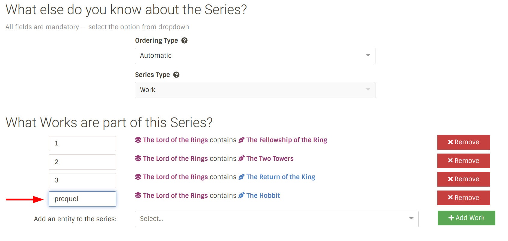

# Series 
-------
A series is a sequence of separate works, authors, editions, edition groups, or publishers with a common theme. The theme is usually prominent in the branding of the entities in the series and the individual entities will often have been given a number indicating the position in the series.

### Examples

- [The Lord of the Rings](https://test.bookbrainz.org/series/e9ffde6e-ffa7-4fe3-b8c5-e548bcbcc938)
- [Harry Potter](https://test.bookbrainz.org/series/e9ffde6e-ffa7-4fe3-b8c5-e548bcbcc938)

#### Series Type
The type primarily describes what type of entity the series contains. The possible values are:

- Work 
- Author 
- Publisher
- Edition
- Edition group 

#### Ordering type
The ordering type determines whether the series is ordered automatically or manually.

### Creating a series

1) Navigate to the series entity editor page by clicking the **series** link from the **+ Add** dropdown menu list.

2) Let's create a series [**The Lord of the Rings**](https://en.wikipedia.org/wiki/The_Lord_of_the_Rings), an epic high fantasy novel by the English author and scholar J. R. R. Tolkien.

- Give the series a name, sort name, and the language.
- Select the ordering type of the series from the dropdown list. (default is Automatic)
- Select the type of the series from the series type dropdown list. (default is Work)

3) The Lord of the Rings has 3 volumes.

- Chapter 1: The Fellowship of the Ring
- Chapter 2: The Two Towers
- Chapter 3: The Return of the King

Let's add these works to the series.

Search for the works and add them to the series.

<!--  -->

<!-- ------- -->

------

continue the same process for the other two works and add them to the series.

Give each works a number, indicating their sequence in the series. For example: the fellowship of the ring is first chapter of the series, we can assign it a value 1, and so on for the other two works.

Note: It is not necessary only to assign a numeric value, you can assign any character. In this case we could have assigned A, B, C instead of 1, 2, 3 or even something more descriptive like "Chapter 1" or "The First Book".

4) Add relationship

